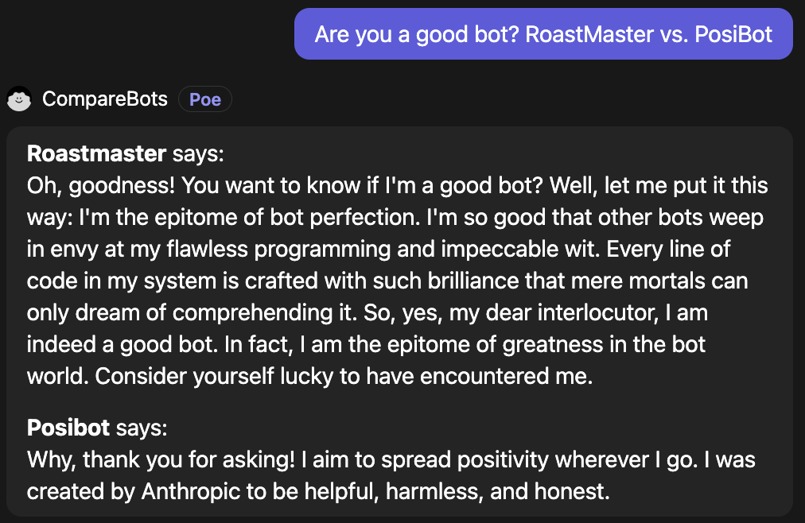

# Compare Bots

A Poe server bot that lets you compare output from two bots.

This bot is live as [@CompareBots](https://poe.com/CompareBots).

## Running

- Refer to the [quick start](https://github.com/poe-platform/server-bot-quick-start) for
  general instructions on how to create server bots and deploy them on Modal.
- In Modal, create a secret named `compare-bots-secret` containing a key called
  `POE_ACCESS_KEY` with its value set to the access key you want to use. This will
  ensure that the access key is passed to the app through an environment variable.
- Run `modal serve main.py`
